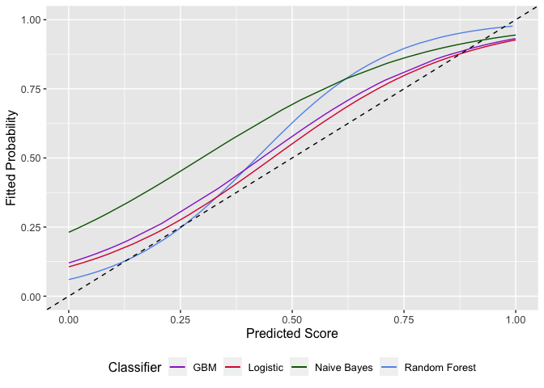
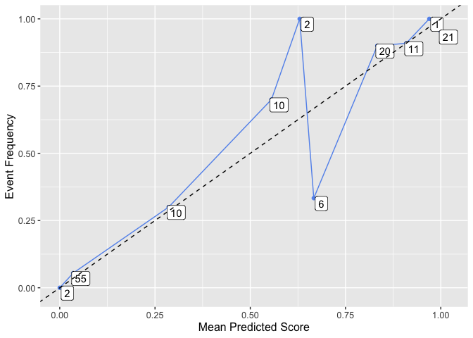

Classifier_Calibration_Appendix
================
Peter
2022-12-03

# Online Appendix to Chapter 4: Application of Re-Calibration Techniques for Classifiers

## Assessing Calibration

Before starting the calibration analysis, the data set has to be splited
into three parts. One subset will be used for training the model,
another subset is needed for training the calibration model, and a final
subset is necessary to evaluate the joint performance of the
classification and recalibration model. The data set is obtained from
the UCI Machine Learning Repository. It is a rather small data set
including 14 features to predict the acceptance of a credit application.
Because of data protection regulations, the data contributors removed
the original feature names. This however, is not problematic, since the
focus is on the resulting scores of the models and not about feature
importance.

Step 1: Classifier Training using Training Data Four different
classification models are trained using the same training sample for
each model.

``` r
target = "Target"
features <- names(train_df)
features <- features[! features %in% c(target)]
formula = as.formula(paste(target, paste(features, collapse=" + "), sep=" ~ "))

rf_classifier = classifier_train_func(classifier_model = "RF")
gbm_classifier = classifier_train_func(classifier_model = "GBM")
nb_classifier = classifier_train_func(classifier_model = "NB")
lr_classifier = classifier_train_func(classifier_model = "LR")
```

Step 2: Train Calibrator using Calibration Data The calibration data set
is now used as an unseen data set which is scored using the
classification models trained above.

``` r
# Assessing calibration of unseen data: calibration data set
rf_scored = classifier_score_func(classifier_model = "RF")
gbm_scored = classifier_score_func(classifier_model = "GBM")
nb_scored = classifier_score_func(classifier_model = "NB")
lr_scored = classifier_score_func(classifier_model = "LR")
```

To get a feeling for the distribution of the predicted scores,
histograms and the empirical cumulative distributions are plotted:

``` r
scores_hist = as.data.frame(cbind(RF = rf_scored$scores, GBM = gbm_scored$scores,
                                  NB = nb_scored$scores, LR = lr_scored$scores)) %>%
  pivot_longer(cols = c("RF", "GBM", "NB", "LR")) %>%
  ggplot()+
  geom_histogram(aes(x = value, fill = as.factor(name))) +
  facet_grid(name~.)+
  xlab("Predicted Score")+
  ylab("Count")+
  scale_fill_manual(values=c('#9932CC', "#DC143C", "#006400", "#6495ED"))+
  theme(legend.position = "none")
  
ecd = ggplot()+
  stat_ecdf(aes(x = rf_scored$scores, color = "Random Forest"))+
  stat_ecdf(aes(x = gbm_scored$scores, color = "GBM"))+
  stat_ecdf(aes(x = nb_scored$scores, color = "Naive Bayes"))+
  stat_ecdf(aes(x = lr_scored$scores, color = "Logistic"))+
  xlab("Predicted Score")+
  ylab("Cumulative Density")+
  theme(legend.position = "bottom", text = element_text(size = 12))+
  scale_color_manual('Classifier', values=c('#9932CC', "#DC143C", "#006400", "#6495ED"))
```

``` r
ecd
```

<!-- -->

``` r
scores_hist
```

<!-- -->

For the Naive Bayes and Boosting model, an accumulation of predicted
scores at the lower and upper end of the distribution over the unit
interval is visible. Scores from the Random Forest model are located
away from the extremes of the distribution. The behavior of Naive Bayes
and Random Forest scores is observed in the scikit learn documentation
as well.

### Calibration Assessment Methods

To assess the calibration of scores produced by the different models
when scoring the unseen data, three different options are presented
below.

#### Binning and Counting

``` r
rf_bc = bin_func(data = rf_scored, nbins = 10, eqdist = TRUE)
gbm_bc = bin_func(data = gbm_scored, nbins = 10, eqdist = TRUE)
nb_bc = bin_func(data = nb_scored, nbins = 10, eqdist = TRUE)
lr_bc = bin_func(data = lr_scored, nbins = 10, eqdist = TRUE)
```

``` r
bc_plot = ggplot()+
  geom_point(aes(x = rf_bc$scores_mean, y = rf_bc$label_mean, color = "Random Forest"))+
  geom_line(aes(x = rf_bc$scores_mean, y = rf_bc$label_mean, color = "Random Forest"))+
  geom_point(aes(x = gbm_bc$scores_mean, y = gbm_bc$label_mean, color = "GBM"))+
  geom_line(aes(x = gbm_bc$scores_mean, y = gbm_bc$label_mean, color = "GBM"))+
  geom_point(aes(x = nb_bc$scores_mean, y = nb_bc$label_mean, color = "Naive Bayes"))+
  geom_line(aes(x = nb_bc$scores_mean, y = nb_bc$label_mean, color = "Naive Bayes"))+
  geom_point(aes(x = lr_bc$scores_mean, y = lr_bc$label_mean, color = "Logistic"))+
  geom_line(aes(x = lr_bc$scores_mean, y = lr_bc$label_mean, color = "Logistic"))+
  geom_abline(intercept = 0, slope = 1, linetype="dashed")+
  xlab("Mean Predicted Score")+
  ylab("Event Frequency")+
  theme(legend.position = "bottom", text = element_text(size = 12))+
  scale_color_manual('Classifier', values=c('#9932CC', "#DC143C", "#006400", "#6495ED"))
```

``` r
bc_err = ggplot()+
  geom_point(aes(x = rf_bc$scores_mean, y = rf_bc$label_mean), color = "#6495ED", size = 2)+
  geom_line(aes(x = rf_bc$scores_mean, y = rf_bc$label_mean), color = "#6495ED", size = 1)+
  geom_errorbar(aes(x = rf_bc$scores_mean,
                    ymin = rf_bc$label_mean-rf_bc$label_sd,
                    ymax = rf_bc$label_mean+rf_bc$label_sd),
                color = '#a10028', size = 1)+
  geom_abline(intercept = 0, slope = 1, linetype="dashed")+
  xlab("Mean Predicted Score")+
  ylab("Event Frequency")+
  theme(legend.position = "bottom", text = element_text(size = 12))
```

``` r
bc_plot
```

<!-- -->

``` r
bc_err
```

<!-- -->

#### Sigmoid Scaling

``` r
rf_sig = sigmoid_fit_func(scores_uncal_label = rf_scored)
rf_sig_fit = rf_sig$preds_sigmoid
gbm_sig = sigmoid_fit_func(scores_uncal_label = gbm_scored)
gbm_sig_fit = gbm_sig$preds_sigmoid
nb_sig = sigmoid_fit_func(scores_uncal_label = nb_scored)
nb_sig_fit = nb_sig$preds_sigmoid
lr_sig = sigmoid_fit_func(scores_uncal_label = lr_scored)
lr_sig_fit = lr_sig$preds_sigmoid

sig_plot = ggplot()+
  geom_line(aes(x = rf_sig_fit$scores, y = rf_sig_fit$probs, color = "Random Forest"))+
  geom_line(aes(x = gbm_sig_fit$scores, y = gbm_sig_fit$probs, color = "GBM"))+
  geom_line(aes(x = nb_sig_fit$scores, y = nb_sig_fit$probs, color = "Naive Bayes"))+
  geom_line(aes(x = lr_sig_fit$scores, y = lr_sig_fit$probs, color = "Logistic"))+
  geom_abline(intercept = 0, slope = 1, linetype="dashed")+
  xlab("Predicted Score")+
  ylab("Fitted Probability")+
  theme(legend.position = "bottom", text = element_text(size = 12))+
  scale_color_manual('Classifier', values=c('#9932CC', "#DC143C", "#006400", "#6495ED"))
sig_plot
```

<!-- -->

#### Isotonic Scaling

``` r
rf_iso = isotonic_fit_func(scores_uncal_label = rf_scored)
rf_iso_fit = rf_iso$preds_iso
gbm_iso = isotonic_fit_func(scores_uncal_label = gbm_scored)
gbm_iso_fit = gbm_iso$preds_iso
nb_iso = isotonic_fit_func(scores_uncal_label = nb_scored)
nb_iso_fit = nb_iso$preds_iso
lr_iso = isotonic_fit_func(scores_uncal_label = lr_scored)
lr_iso_fit = lr_iso$preds_iso

iso_plot = ggplot()+
  geom_line(aes(x = rf_iso_fit$scores, y = rf_iso_fit$probs, color = "Random Forest"))+
  geom_line(aes(x = gbm_iso_fit$scores, y = gbm_iso_fit$probs, color = "GBM"))+
  geom_line(aes(x = nb_iso_fit$scores, y = nb_iso_fit$probs, color = "Naive Bayes"))+
  geom_line(aes(x = lr_iso_fit$scores, y = lr_iso_fit$probs, color = "Logistic"))+
  geom_abline(intercept = 0, slope = 1, linetype="dashed")+
  xlab("Predicted Score")+
  ylab("Fitted Probability")+
  theme(legend.position = "bottom", text = element_text(size = 12))+
  scale_color_manual('Classifier', values=c('#9932CC', "#DC143C", "#006400", "#6495ED"))
iso_plot
```

<!-- -->

### Calibration Analysis

Dimitriadis et al propose two further enhancements to the calibration
assessment. First a decomposition of the Brier score into components
measuring the miscalibration and the discrimination and the costruction
of uncertainty regions around the isotonic regression function.

#### Score Decomposition

``` r
rf_decomp = score_decomp_func(x = rf_iso_fit$scores, y_hat = rf_iso_fit$probs, y_obs = rf_iso_fit$label)
gbm_decomp = score_decomp_func(x = gbm_iso_fit$scores, y_hat = gbm_iso_fit$probs, y_obs = gbm_iso_fit$label)
nb_decomp = score_decomp_func(x = nb_iso_fit$scores, y_hat = nb_iso_fit$probs, y_obs = nb_iso_fit$label)
lr_decomp = score_decomp_func(x = lr_iso_fit$scores, y_hat = lr_iso_fit$probs, y_obs = lr_iso_fit$label)

decomp = data.frame(rbind(rf = rf_decomp[,c("S_x", "MCB", "DSC", "UNC")],
                          gbm = gbm_decomp[,c("S_x", "MCB", "DSC", "UNC")],
                          nb = nb_decomp[,c("S_x", "MCB", "DSC", "UNC")],
                          lr = lr_decomp[,c("S_x", "MCB", "DSC", "UNC")]))

knitr::kable(decomp, caption = "CORP Score Decomposition")
```

|     |       S_x |       MCB |       DSC |       UNC |
|:----|----------:|----------:|----------:|----------:|
| rf  | 0.1147515 | 0.0206232 | 0.1516184 | 0.2457467 |
| gbm | 0.1254152 | 0.0360953 | 0.1564268 | 0.2457467 |
| nb  | 0.1965513 | 0.0821068 | 0.1313022 | 0.2457467 |
| lr  | 0.1358465 | 0.0254759 | 0.1353761 | 0.2457467 |

CORP Score Decomposition

The overall best performance in terms of the Brier score is delivered by
Random Forest Scores, while Naive Bayes performs poorest. As well as in
terms of miscalibration, Random Forest dominates while Naive Bayes is
worst. The poor calibration performance of Naive Bayes is documented in
Zadrozny and Elkan (2002). The discrimination component is best for the
Boosting scores. As Dimitriadis et al mentioned, this component can be
compared to the area under the ROC curve, which is a common measure in
binary classification. As presented below, the Boosting model also
reaches the best AUC value.

``` r
rf_perf = calc_auc(scores = rf_scored$scores, label = rf_scored$label)
rf_auc = rf_perf$auc
rf_roc = rf_perf$roc
gbm_perf = calc_auc(scores = gbm_scored$scores, label = gbm_scored$label)
gbm_auc = gbm_perf$auc
gbm_roc = gbm_perf$roc
nb_perf = calc_auc(scores = nb_scored$scores, label = nb_scored$label)
nb_auc = nb_perf$auc
nb_roc = nb_perf$roc
lr_perf = calc_auc(scores = lr_scored$scores, label = lr_scored$label)
lr_auc = lr_perf$auc
lr_roc = lr_perf$roc

ggplot()+
  geom_line(aes(x = rf_roc@x.values[[1]], rf_roc@y.values[[1]], color = "Random Forest"))+
  geom_line(aes(x = gbm_roc@x.values[[1]], gbm_roc@y.values[[1]], color = "GBM"))+
  geom_line(aes(x = nb_roc@x.values[[1]], nb_roc@y.values[[1]], color = "Naive Bayes"))+
  geom_line(aes(x = lr_roc@x.values[[1]], lr_roc@y.values[[1]], color = "Logistic"))+
  theme(legend.position = "bottom", text = element_text(size = 16))+
  scale_color_manual('Classifier', values=c('#9932CC', "#DC143C", "#006400", "#6495ED"))+
  xlab("False Positive Rate")+
  ylab("True Positive Rate")+
  #scale_x_continuous(limits = c(0, 0.25))+
  #scale_y_continuous(limits = c(0.5, 1))+
  geom_label(aes(label = paste0("AUC", "\n", "RF: ", round(rf_auc, 4), "\n", "GBM: ", round(gbm_auc, 4), "\n",
                                "NB: ", round(nb_auc, 4), "\n", "Logistic: ", round(lr_auc, 4))), 
             x = 0.75, y = 0.25, color = "yellow", fill = "black", size = 4)
```

<!-- -->

#### Uncertainty Assessment

The construction of uncertainty regions is documented in Dimitriadis et
al and in the online appendix accompanying their paper. Basically, they
distinguish between consistency bands around a perfect calibration
(diagonal) and confidence bands around the fitted regression function.
Besides asymptotic theory, they employ a resampling approach to
construct the uncertainty bands as well. The upper panels of the plot
below shows consistency (left) and confidence (right) regions for the
isotonic fit of Random Forest Scores evaluated with the true labels
belonging to the scored units. The bottom left panel shows a consistency
band using discrete asymptotics while the right panel assumes a
continuous distribution of the scores.

``` r
reldiag_func = function(data, position, method, fit_col){
  library(reliabilitydiag)
  r = reliabilitydiag(x = data$scores, y = data$label, region.position = position, region.method = method)$x
  
  r_plot = ggplot()+
    geom_ribbon(aes(x=r$regions$x, ymin=r$regions$lower, 
                    ymax=r$regions$upper, 
                    fill = 'Uncertainty'), alpha = 0.6)+
    geom_point(aes(x=sort(data$scores), y=r$cases$CEP_pav, color='Isotonic Fit'), size = 2)+
    geom_line(aes(x=sort(data$scores), y=r$cases$CEP_pav, color='Isotonic Fit'), size = 1)+
    geom_abline(intercept = 0, slope = 1, linetype="dashed")+
    scale_color_manual('', values=c(fit_col))+
    scale_fill_manual('', values=c('#a10028'))+
    theme(legend.position = "none", text = element_text(size = 12))+
    xlab("Predicted Score")+
    ylab("Fitted Probability")
  
  return(r_plot)
}
ggarrange(reldiag_func(data = rf_scored, position = "diagonal", method = "resampling", fit_col = "#6495ED"),
          reldiag_func(data = rf_scored, position = "estimate", method = "resampling", fit_col = "#6495ED"),
          reldiag_func(data = rf_scored, position = "diagonal", method = "discrete_asymptotics", fit_col = "#6495ED"),
          reldiag_func(data = rf_scored, position = "diagonal", method = "continuous_asymptotics", fit_col = "#6495ED"),
          nrow = 2, ncol = 2, common.legend = TRUE)
```

<!-- -->

## Re-Calibration

This section evaluates the calibration performance of classification and
calibration model jointly. In a productive setting, where the true label
of an observation is unknown, the two models should produce well
calibrated probabilities together. Therefore, a third data set, the
testing data set is used. The observations of this set are scored using
the classification model and then re-calibrated subsequently. In
contrast to a productive setting, the true labels are known for this
test set, allowing for a final assessment of the calibration.

### Train-Calibration-Test Split

Using a simple split into three subsamples, one is used to train the
classification model. The second set is scored on the classifier.
Subsequently, the obtained scores are used to train the recalibration
model. At this point a classification and calibration model are trained.
Now, the third set, which is unknown to both models, is fed through both
models. The following analysis should verify, if using both models
together yield better calibrated scores than using the classification
model only. Since the test set has not been used to train the model
before, the calibration will not be perfect.

Applying the CORP score decomposition on the recalibrated scores
obtained yields the following insights below. For all three
classification models, the Brier score and the miscalibration component
can be reduced when employing the calibration model (sigmoid or
isotonic). Isotonic rescaling yields lower miscalibration than sigmoid
rescaling. However, due to the reduced number of recalibrated scores
(horizontal segments in isotonic fit), discrimination ability is lost.

``` r
rf_test = score_test_func(classifier_model = "RF", classifier = rf_classifier, 
                          calibrator_sigmoid = rf_sig$calibrator_sigmoid,
                          iso_func_in = rf_iso$iso_func, test_df = test_df)
gbm_test = score_test_func(classifier_model = "GBM", classifier = gbm_classifier,
                           calibrator_sigmoid = gbm_sig$calibrator_sigmoid,
                           iso_func = gbm_iso$iso_func, test_df = test_df)
nb_test = score_test_func(classifier_model = "NB", classifier = nb_classifier,
                          calibrator_sigmoid = nb_sig$calibrator_sigmoid,
                          iso_func = nb_iso$iso_func, test_df = test_df)


test_assess_func(data = rf_test)
```

    ##          mean_score miscalibration discrimination uncertainty
    ## uncal    0.10808728    0.023508439      0.1649486   0.2495274
    ## sigmoid  0.10499608    0.020417236      0.1649486   0.2495274
    ## isotonic 0.09667475    0.003357524      0.1562102   0.2495274

``` r
test_assess_func(data = gbm_test)
```

    ##          mean_score miscalibration discrimination uncertainty
    ## uncal     0.1291826     0.02711835      0.1474632   0.2495274
    ## sigmoid   0.1243174     0.02225325      0.1474632   0.2495274
    ## isotonic  0.1223025     0.01494889      0.1421738   0.2495274

``` r
test_assess_func(data = nb_test)
```

    ##          mean_score miscalibration discrimination uncertainty
    ## uncal     0.2113858     0.09462265      0.1327642   0.2495274
    ## sigmoid   0.1635735     0.04681034      0.1327642   0.2495274
    ## isotonic  0.1337986     0.01395984      0.1296886   0.2495274

The plot below shows how un-calibrated scores are mapped into their
re-calibrated counterparts when using isotonic re-scaling. Due to
horizontal segments, a priori distinct scores can be mapped into
non-distinct probability estimates.

``` r
ggplot()+
  geom_line(aes(x = rf_test$scores_uncal, y = rf_test$probs_iso, color = "Random Forest"))+
  geom_line(aes(x = gbm_test$scores_uncal, y = gbm_test$probs_iso, color = "GBM"))+
  geom_line(aes(x = nb_test$scores_uncal, y = nb_test$probs_iso, color = "Naive Bayes"))+
  geom_abline(intercept = 0, slope = 1, linetype="dashed")+
  xlab("Predicted Score")+
  ylab("Fitted Probability")+
  theme(legend.position = "bottom", text = element_text(size = 16))+
  scale_color_manual('Classifier', values=c('#9932CC', "#DC143C", "#6495ED"))
```

<!-- --> Having a
closer look into the calibration of test scores from a Random Forest
classification model together with an isotonic calibration model are
analysed using binning and counting. Since there are only ten unique
fitted probabilities resulting, the approach can be justified. The boxed
numbers below the bin points indicate the number of observations per
bin. Except for bin five and six, the calibration appears to be decent.

``` r
rf_test %>%
  group_by(probs_iso)%>%
  dplyr::summarise(
      count = n(),
      label_mean = mean(label),
      prob_disc = mean(probs_iso)) %>%
  ggplot()+
  geom_point(aes(x = prob_disc, y = label_mean), col="#6495ED")+
  geom_line(aes(x = prob_disc, y = label_mean), col="#6495ED")+
  geom_label(aes(x = prob_disc, y = label_mean, label = count), nudge_y = -0.05)+
  geom_abline(intercept = 0, slope = 1, linetype="dashed")+
  xlab("Mean Predicted Score")+
  ylab("Event Frequency")+
  theme(legend.position = "bottom", text = element_text(size = 12))
```

<!-- -->

### Cross-Validation

Instead of using a simple three-fold split, the training of
classification and calibration model can be done using cross-validation
as suggested in the scikit-learn documentation. The test set remains
unchanged to ensure comparability with the approach above. The training
and calibration data set are now merged into one large training set,
which is split into $k=5$ subsets. The histogram below shows the
distribution of units in each subset. Since the number of observations
is not dividable by 5, there are slight imbalanes. On four of those, the
classification model is trained. The left out part is scored on the
model. The resulting scores are used to train the calibration model.
This procedure is repeated 5 times, such that each part was used once to
train the calibration model.

``` r
train_df_cv = rbind(train_df, calib_df)
test_df_cv = test_df
set.seed(231122)
id = sample(rep(1:5, each = ceiling(nrow(train_df_cv)/5)))
id = id[1:nrow(train_df_cv)]
hist(id)
```

<!-- -->

``` r
train_cv = cbind(train_df_cv, id)

target = "Target"
features <- names(train_df_cv)
features <- features[! features %in% c(target)]
formula = as.formula(paste(target, paste(features, collapse=" + "), sep=" ~ "))


# Train Classification Models and Sigmoid/Isotonic Calibrator
rf_cv_train = train_cv_func(classifier_model = "RF", train_cv = train_cv)
gbm_cv_train = train_cv_func(classifier_model = "GBM", train_cv = train_cv)
nb_cv_train = train_cv_func(classifier_model = "NB", train_cv = train_cv)

# Run unseen test data through models

rf_test_cv_result = test_cv_func(classifier_model = "RF", Classifier_list = rf_cv_train$Classifier_list,
                              Sigmoid_list = rf_cv_train$Sigmoid_list, Isotonic_list = rf_cv_train$Isotonic_list,
                              test_df = test_df_cv)
gbm_test_cv_result = test_cv_func(classifier_model = "GBM", Classifier_list = gbm_cv_train$Classifier_list,
                                 Sigmoid_list = gbm_cv_train$Sigmoid_list, Isotonic_list = gbm_cv_train$Isotonic_list,  test_df = test_df_cv)
nb_test_cv_result = test_cv_func(classifier_model = "NB", Classifier_list = nb_cv_train$Classifier_list,
                                 Sigmoid_list = nb_cv_train$Sigmoid_list, Isotonic_list = nb_cv_train$Isotonic_list, test_df = test_df_cv)
```

Unused observations from the test set are first scored on all 5
classification models. Those scores are averaged for each unit in the
test set. The averaged scores are then fed into the 5 calibration
models. Again, for each unit, 5 probability estimates are obtained and
consequently averaged by unit. The calibration of those resulting
probability estimates is again evaluated using the CORP decomposition.
For Random Forest and Naive Bayes, there is an improvement in the
miscalibration when using the calibration models. Boosted scores seem
not to profit from that.

``` r
test_assess_func(data = rf_test_cv_result)
```

    ##          mean_score miscalibration discrimination uncertainty
    ## uncal     0.1032055     0.01837413      0.1646961   0.2495274
    ## sigmoid   0.1012311     0.01639980      0.1646961   0.2495274
    ## isotonic  0.1005435     0.01508271      0.1640666   0.2495274

``` r
test_assess_func(data = gbm_test_cv_result)
```

    ##          mean_score miscalibration discrimination uncertainty
    ## uncal     0.1047334     0.01784319      0.1626372   0.2495274
    ## sigmoid   0.1075200     0.02062981      0.1626372   0.2495274
    ## isotonic  0.1125024     0.02321094      0.1602359   0.2495274

``` r
test_assess_func(data = nb_test_cv_result)
```

    ##          mean_score miscalibration discrimination uncertainty
    ## uncal     0.1851119     0.06002553      0.1244411   0.2495274
    ## sigmoid   0.1553751     0.03028874      0.1244411   0.2495274
    ## isotonic  0.1440049     0.01414342      0.1196660   0.2495274

The plot below shows again the mapping of un-calibrated scores into
probability estimates for a isotonic calibration model. Due to the
averaging of multiple models, there are less horizontal segments and
thus more unique probability estimates as above. This results into
higher discrimination components on average for the cross-validated
estimates than the simple splitted estimates.

``` r
# Graphical analysis
ggplot()+
  geom_line(aes(x = rf_test_cv_result$scores_uncal, y = rf_test_cv_result$probs_iso, color = "Random Forest"))+
  geom_line(aes(x = gbm_test_cv_result$scores_uncal, y = gbm_test_cv_result$probs_iso, color = "GBM"))+
  geom_line(aes(x = nb_test_cv_result$scores_uncal, y = nb_test_cv_result$probs_iso, color = "Naive Bayes"))+
  geom_abline(intercept = 0, slope = 1, linetype="dashed")+
  xlab("Predicted Score")+
  ylab("Fitted Probability")+
  theme(legend.position = "bottom", text = element_text(size = 16))+
  scale_color_manual('Classifier', values=c('#9932CC', "#DC143C", "#6495ED"))
```

<!-- -->

### Comparison

The comparison is conducted for the Random Forest classification model
but could be applied to the other models as well.

Using the simple three-fold split to train the classifier, the
calibrator and evaluate its combined performance, yields only a few
distinct probability estimates when employing isotonic scaling on a
small data set. With Cross-Validation, there are more unique probability
estimates due to the averaging of the $k$ different calibration models.
This characteristic is visible in the plot below. When mapping the
predicted scores from the first stage classification model, to their
respective calibrated counterpart, a wide range of distinct scores are
assigned a unique calibrated probability. However, the cross-validated
calibrated probabilities exhibit less horizontal segments, indicating
more unique probability estimates for the test set observations.

``` r
ggplot()+
  geom_line(aes(x = rf_test_cv_result$scores_uncal, y = rf_test_cv_result$probs_iso, color = "Cross-Validation"), size=1.1)+
  geom_line(aes(x = rf_test$scores_uncal, y = rf_test$probs_iso, color = "Simple Split"), size=1.1)+
  geom_point(aes(x = rf_test$scores_uncal, y = rf_test$label), color = "#7a8b8b")+
  geom_abline(intercept = 0, slope = 1, linetype="dashed")+
  xlab("Not-calibrated Score")+
  ylab("Calibrated Score")+
  theme(legend.position = "bottom", text = element_text(size = 16))+
  scale_color_manual('Re-Calibration Method', values=c("#2a5a83", "#ff700f"))
```

<!-- -->

Using the CORP procedure to analyse the calibration performance of the
productive probability estimates, we see an improvement of the
miscalibration when employing a re-scaling procedure. This holds for
both approaches, simple and cross-validation. In this case, with a small
data set, the simple split approach outperforms the cross-validation.
Splitting the data in multiple even smaller subsets decreases the
performance of the calibration model. Even though, their results are
averaged, the simple split profits from having more data at hand to fit
the calibrator.

In terms of discrimination, the cross-validation approach dominates.
This can be identified from the Discrimination component in the CORP
Score Decomposition but also from the AUC of the ROC curve. When using
isotonic scaling, the number of distinct probability estimates
decreases. CV produces more distinct estimates which allows for better
discrimination. The scatter plot shows, that the simple split produces
less distinct estimates as CV.

``` r
# Score Decomposition
corp_simple = test_assess_func(data = rf_test)
corp_cv = test_assess_func(data = rf_test_cv_result)

corp_simple
```

    ##          mean_score miscalibration discrimination uncertainty
    ## uncal    0.10808728    0.023508439      0.1649486   0.2495274
    ## sigmoid  0.10499608    0.020417236      0.1649486   0.2495274
    ## isotonic 0.09667475    0.003357524      0.1562102   0.2495274

``` r
corp_cv
```

    ##          mean_score miscalibration discrimination uncertainty
    ## uncal     0.1032055     0.01837413      0.1646961   0.2495274
    ## sigmoid   0.1012311     0.01639980      0.1646961   0.2495274
    ## isotonic  0.1005435     0.01508271      0.1640666   0.2495274

``` r
# Obtain Calibration Assessment
r_simple  = reliabilitydiag(x = rf_test$probs_iso, y = rf_test$label)$x
r_cv = reliabilitydiag(x = rf_test_cv_result$probs_iso, y = rf_test_cv_result$label)$x

ggplot()+
    geom_point(aes(x=sort(rf_test$probs_iso), y=r_simple$cases$CEP_pav, color="Simple Split"), size = 1.1)+
    geom_point(aes(x=sort(rf_test_cv_result$probs_iso), y=r_cv$cases$CEP_pav, color="Cross-Validation"), size = 1.1)+
    geom_abline(intercept = 0, slope = 1, linetype="dashed")+
    scale_color_manual('Re-Calibration Method', values=c("#ff700f", "#2a5a83"),
                     breaks = c("Simple Split", "Cross-Validation"))+
    theme(legend.position = "bottom", text = element_text(size = 12))+
    xlab("Re-Calibrated Score")+
    ylab("Fitted Probability")
```

<!-- -->

``` r
# ROC comparison
perf_none = calc_auc(scores = rf_test$scores_uncal, label = rf_test$label)
perf_simple = calc_auc(scores = rf_test$probs_iso, label = rf_test$label)
perf_cv = calc_auc(scores = rf_test_cv_result$probs_iso, label = rf_test_cv_result$label)

ggplot()+
  geom_line(aes(x = perf_none$roc@x.values[[1]], perf_none$roc@y.values[[1]], color = "None"), size=1.1)+
  geom_line(aes(x = perf_simple$roc@x.values[[1]], perf_simple$roc@y.values[[1]], color = "Simple Split"), size=1.1)+
  geom_line(aes(x = perf_cv$roc@x.values[[1]], perf_cv$roc@y.values[[1]], color = "Cross-Validation"), size=1.1)+
  theme(legend.position = "bottom", text = element_text(size = 16))+
  scale_color_manual('Re-Calibration Method', values=c("#228B22", "#ff700f", "#2a5a83"),
                     breaks = c("None", "Simple Split", "Cross-Validation"))+
  xlab("False Positive Rate")+
  ylab("True Positive Rate")+
  geom_label(aes(label = paste0("AUC", "\n", "None: ", round(perf_none$auc, 4), "\n", "Simple Split: ", round(perf_simple$auc, 4), "\n",
                                "CV: ", round(perf_cv$auc, 4))), 
             x = 0.75, y = 0.25, color = "yellow", fill = "black", size = 4)
```

<!-- -->

## Optimization

Until now, the hyper-parameters of the classification models were
treated as given. However, they can be optimized. Using the simple split
approach, a search algorithm tries to identify the parameter combination
that yields lowest miscalibration of re-calibrated scores of a testing
data set. When calibration is not of interest, other metrics can used
for optimization, as the AUC.

### Grid Search

Grid search uses a grid of pre-defined parameter values and tries to
find the combination that yields an optimal metric value, i.e. a minimum
miscalibration of an unseen test data set.

``` r
MCB_GS = matrix(ncol = 4)
MCB_GS = array(dim = c(3,3,3))

mtry_GS = c(1, 3, 5)
ntree_GS = c(100, 200, 300)
maxnodes_GS = c(5, 10, 15)

for (i in c(1:3)) {
  for(j in c(1:3)){
    for (k in c(1:3)) {
      set.seed(1234)
      classifier_GS = randomForest::randomForest(formula, data = train_df, 
                                                 mtry = mtry_GS[i], 
                                                 ntree = ntree_GS[j], 
                                                 maxnodes = maxnodes_GS[k], 
                                                 nodesize = 3,
                                                 importance = FALSE)

      # Score Calibration data set on classifier
      scores_uncal_GS = predict(classifier_GS, newdata = calib_df, type = "prob")[,2]
      
      scores_uncal_label_GS = as.data.frame(cbind(scores = scores_uncal_GS,
                                                  label  = as.numeric(calib_df$Target)-1))
      
      
      # Train Isotonic regression: no hyper parameters needed
      rf_iso_GS = isotonic_fit_func(scores_uncal_label = scores_uncal_label_GS)
      rf_iso_fit_GS = rf_iso_GS$preds_iso
      iso_func_in_GS = rf_iso_GS$iso_func
      
      # Score Test Data on classifier
      scores_uncalib_test_GS = predict(classifier_GS, newdata = test_df, type = "prob")[,2]
      recalib_iso_test_GS = iso_func_in_GS(scores_uncalib_test_GS)
      
      calibs_test = as.data.frame(cbind(label = as.numeric(test_df$Target)-1,
                                        scores_uncal = scores_uncalib_test_GS,
                                        probs_iso = recalib_iso_test_GS))
      calibs_test = calibs_test[order(calibs_test$scores_uncal),]
      
      # Score Decomposition to obtain MCB
      r_GS = summary(reliabilitydiag(x = calibs_test$probs_iso, y = calibs_test$label))
      MCB_GS[i, j, k] = r_GS$miscalibration
    }
  }
}

idx_min_GS = which(MCB_GS == min(MCB_GS), arr.ind = TRUE)
as.data.frame(cbind(mtry = mtry_GS[idx_min_GS[1]],
                    ntrees = ntree_GS[idx_min_GS[2]],
                    maxnodes = maxnodes_GS[idx_min_GS[3]],
                    optimalMCB = MCB_GS[idx_min_GS]))
```

    ##   mtry ntrees maxnodes  optimalMCB
    ## 1    1    300       15 0.003391782

Grid search identifies a minimum miscalibration, when using mtry = 1,
ntrees = 300 and maxnodes = 15. Since there are even more
hyper-parameters to choose, the search can be extended. It is also
useful to use a range of different values for each parameter but the
computational demand increases quickly.

### Genetic Algorithm Optimization

The genetic algorithm learns iteration by iteration in which direction
to change the parameter values to optimize the metric.

``` r
library(gramEvol)
```

    ## Warning: package 'gramEvol' was built under R version 3.6.2

``` r
library(parallel)

eval_func = function(gen, train, calib, test, model_type, metric){
  # Train Classifier
  set.seed(1234)
  classifier_GA = randomForest::randomForest(formula, data = train, 
                                          mtry = gen[1], 
                                          ntree = gen[2], 
                                          maxnodes = gen[3], 
                                          nodesize = 3,
                                          importance = FALSE)
  
  # Score Calibration data set on classifier
  scores_uncal_GA = predict(classifier_GA, newdata = calib, type = "prob")[,2]
  
  scores_uncal_label_GA = as.data.frame(cbind(scores = scores_uncal_GA,
                                           label  = as.numeric(calib$Target)-1))
  
  # Train Isotonic regression: no hyper parameters needed
  rf_iso_GA = isotonic_fit_func(scores_uncal_label = scores_uncal_label_GA)
  rf_iso_fit_GA = rf_iso_GA$preds_iso
  iso_func_in_GA = rf_iso_GA$iso_func
  
  # Score Test Data on classifier
  scores_uncalib_test_GA = predict(classifier_GA, newdata = test, type = "prob")[,2]
  recalib_iso_test_GA = iso_func_in_GA(scores_uncalib_test_GA)
  
  calibs_test = as.data.frame(cbind(label = as.numeric(test$Target)-1,
                                    scores_uncal = scores_uncalib_test_GA,
                                    probs_iso = recalib_iso_test_GA))
  calibs_test = calibs_test[order(calibs_test$scores_uncal),]
  
  # Score Decomposition to obtain MCB
  r_GS = summary(reliabilitydiag(x = calibs_test$probs_iso, y = calibs_test$label))
  MCB = r_GS$miscalibration
  negDSC = -r_GS$discrimination
  if(metric == "MCB"){
    # Return MCB as objective to minimize
    return(MCB)
  }else if(metric == "DSC"){
    # Return negative DSC as objective to minimize, as DSC should be maximized
    return(negDSC)
  }
  
  
}

monitor_func = function(result){
  cat("Best of gen: ", min(result$best$cost), "Params: ", result$best$genome, "\n")
}
```

Optimizing on minimum Miscalibration

``` r
system.time({
  set.seed(231122)
  gen_res_rf = GeneticAlg.int(genomeLen = 3, genomeMin = c(1, 50, 1), genomeMax = c(4, 500, 15),
                              popSize = 9, iterations = 5, mutationChance = 0.2, plapply = mclapply,
                              allowrepeat = TRUE, monitorFunc = monitor_func,
                              evalFunc = function(x) eval_func(x, train = train_df,
                                                               calib = calib_df,
                                                               test = test_df, 
                                                               model_type = "RF", 
                                                               metric = "MCB"))
})
```

    ## Best of gen:  0.0026323 Params:  2 354 10 
    ## Best of gen:  0.003975002 Params:  1 136 2 
    ## Best of gen:  0.005602458 Params:  2 397 8 
    ## Best of gen:  0.004098251 Params:  1 315 11 
    ## Best of gen:  0.004098251 Params:  1 315 11

    ##    user  system elapsed 
    ##  20.460   2.062  13.831

Optimizing on maximum Discrimination

``` r
system.time({
set.seed(231122)
gen_res_rf = GeneticAlg.int(genomeLen = 3, genomeMin = c(1, 50, 1), genomeMax = c(4, 500, 15),
                            popSize = 9, iterations = 5, mutationChance = 0.2, plapply = mclapply,
                            allowrepeat = TRUE, monitorFunc = monitor_func,
                            evalFunc = function(x) eval_func(x, train = train_df,
                                                             calib = calib_df,
                                                             test = test_df, 
                                                             model_type = "RF", 
                                                             metric = "DSC"))
})
```

    ## Best of gen:  -0.1636639 Params:  3 404 14 
    ## Best of gen:  -0.1639898 Params:  4 404 14 
    ## Best of gen:  -0.1640125 Params:  4 402 14 
    ## Best of gen:  -0.1640125 Params:  4 402 14 
    ## Best of gen:  -0.1640125 Params:  4 402 14

    ##    user  system elapsed 
    ##  21.950   2.027  14.756

<!-- #### Sigmoid Scaling -->
<!-- ```{r} -->
<!-- sigmoid_scale_func = function(scores_uncal_label, main){ -->
<!--   set.seed(1234) -->
<!--   calibrator_sigmoid = glm(label ~ scores, data = scores_uncal_label, family = "binomial") -->
<!--   preds_sigmoid = as.data.frame(cbind(scores = scores_uncal_label$scores,  -->
<!--                                       probs = predict(calibrator_sigmoid,  type = "response"))) -->
<!--   preds_sigmoid = preds_sigmoid[order(preds_sigmoid$scores), ] -->
<!--   plot(scores_uncal_label$scores, scores_uncal_label$label, col = "blue", main = paste0("Sigmoid Scaling - ", main), -->
<!--        xlab = "Predicted Score", ylab = "Recalibrated Score / True Label") -->
<!--   lines(probs ~ scores, preds_sigmoid, col = "red", lwd = 2) -->
<!--   return(list(preds_sigmoid = preds_sigmoid, -->
<!--               calibrator_sigmoid = calibrator_sigmoid)) -->
<!-- } -->
<!-- rf_preds_sigmoid = sigmoid_scale_func(scores_uncal_label = rf_scored, main = "RF") -->
<!-- gbm_preds_sigmoid = sigmoid_scale_func(scores_uncal_label = gbm_scored, main = "GBM") -->
<!-- nb_preds_sigmoid = sigmoid_scale_func(scores_uncal_label = nb_scored, main = "NB") -->
<!-- ``` -->
<!-- #### Isotonic Scaling -->
<!-- ```{r} -->
<!-- isotonic_scale_func = function(scores_uncal_label, main){ -->
<!--   scores_uncal_label_sorted = scores_uncal_label[order(scores_uncal_label$scores),] -->
<!--   iso = isoreg(x = scores_uncal_label_sorted$scores, y = scores_uncal_label_sorted$label) -->
<!--   x_func = c(0, iso$x, 1) -->
<!--   y_func = c(0, iso$yf, 1)  -->
<!--   xy_func = as.data.frame(cbind(x_func, y_func)) -->
<!--   iso_func = approxfun(xy_func$x_func, xy_func$y_func, ties=min) -->
<!--   preds_iso = as.data.frame(cbind(scores = scores_uncal_label$scores,  -->
<!--                                   probs = iso_func(scores_uncal_label$scores))) -->
<!--   preds_iso = preds_iso[order(preds_iso$scores),] -->
<!--   prefix = paste0(tolower(main),"_") -->
<!--   plot(scores_uncal_label$scores, scores_uncal_label$label, col = "blue", main = paste0("Recalibration Scaling - ", main), -->
<!--        xlab = "Predicted Score", ylab = "Recalibrated Score / True Label") -->
<!--   lines(probs ~ scores, eval(as.symbol(paste0(prefix,"preds_sigmoid")))$preds_sigmoid, col = "red", lwd = 2) -->
<!--   lines(probs ~ scores, preds_iso, col = "darkgreen", lwd = 2) -->
<!--   legend("right", c("Sigmoid", "Isotonic"), fill = c("red", "darkgreen")) -->
<!--   return(list(preds_iso = preds_iso, -->
<!--               iso_func = iso_func)) -->
<!-- } -->
<!-- rf_preds_isotonic = isotonic_scale_func(scores_uncal_label = rf_scored, main = "RF") -->
<!-- gbm_preds_isotonic = isotonic_scale_func(scores_uncal_label = gbm_scored, main = "GBM") -->
<!-- nb_preds_isotonic = isotonic_scale_func(scores_uncal_label = nb_scored, main = "NB") -->
<!-- ``` -->
<!-- ### Evaluate Performacne using Test Data -->
<!-- #### Run Test Data through Models -->
<!-- ```{r, message=FALSE} -->
<!-- score_test_func = function(classifier_model, classifier, calibrator_sigmoid, iso_func_in){ -->
<!--   if (classifier_model == "RF"){ -->
<!--     scores_uncalib_test = predict(classifier, newdata = test_df, type = "prob")[,2] -->
<!--   } else if (classifier_model == "GBM"){ -->
<!--     scores_uncalib_test = predict(classifier, newdata = test_df, type = "response") -->
<!--   } else if (classifier_model == "NB"){ -->
<!--     scores_uncalib_test = predict(classifier, newdata = test_df, type = "raw")[,2] -->
<!--   } else if (classifier_model == "LR"){ -->
<!--     scores_uncalib_test = predict(classifier, newdata = test_df, type = "response")}  -->
<!--   recalib_sigmoid_test = predict(calibrator_sigmoid,  -->
<!--                                  newdata = as.data.frame(cbind(scores = scores_uncalib_test)), -->
<!--                                  type = "response") -->
<!--   recalib_iso_test = iso_func_in(scores_uncalib_test) -->
<!--   calibs_test = as.data.frame(cbind(label = as.numeric(test_df$Target)-1, -->
<!--                                     scores_uncal = scores_uncalib_test, -->
<!--                                     probs_sig = recalib_sigmoid_test, -->
<!--                                     probs_iso = recalib_iso_test)) -->
<!--   calibs_test = calibs_test[order(calibs_test$scores_uncal),] -->
<!--   return(calibs_test) -->
<!-- } -->
<!-- rf_test = score_test_func(classifier_model = "RF", classifier = rf_classifier,  -->
<!--                           calibrator_sigmoid = rf_preds_sigmoid$calibrator_sigmoid, -->
<!--                           iso_func_in = rf_preds_isotonic$iso_func) -->
<!-- gbm_test = score_test_func(classifier_model = "GBM", classifier = gbm_classifier, -->
<!--                            calibrator_sigmoid = gbm_preds_sigmoid$calibrator_sigmoid, -->
<!--                           iso_func = gbm_preds_isotonic$iso_func) -->
<!-- nb_test = score_test_func(classifier_model = "NB", classifier = nb_classifier, -->
<!--                           calibrator_sigmoid = nb_preds_sigmoid$calibrator_sigmoid, -->
<!--                           iso_func = nb_preds_isotonic$iso_func) -->
<!-- ``` -->
<!-- #### Graphical Assessment -->
<!-- ```{r, results='hide', message=FALSE, fig.keep='all'} -->
<!-- graph_func = function(calibs_test, classifier_model){ -->
<!--   recal = ggplot(calibs_test)+ -->
<!--     geom_point(aes(x = scores_uncal, y = label, color = "Observed"))+ -->
<!--     geom_point(aes(x = scores_uncal, y = probs_sig, color = "Sigmoid"))+ -->
<!--     geom_point(aes(x = scores_uncal, y = probs_iso, color = "Isotonic"))+ -->
<!--     geom_line(aes(x = scores_uncal, y = probs_sig, color = "Sigmoid"))+ -->
<!--     geom_line(aes(x = scores_uncal, y = probs_iso, color = "Isotonic"))+ -->
<!--     xlab("Uncalibrated Scores")+ -->
<!--     ylab("Scores / Probabilities")+ -->
<!--     ggtitle(paste0("Re-Calibrated Scores of Test Data - ", classifier_model))+ -->
<!--     labs(color = "Legend") -->
<!--   # Reliability Diagrams -->
<!--   # Uncalibrated -->
<!--   data_uncal = calibs_test[,c("scores_uncal", "label")] -->
<!--   colnames(data_uncal) = c("p1", "true_label") -->
<!--   uncal_bin = bin_func(data = data_uncal, nbins = 20, eqdist = FALSE) -->
<!--   # Sigmoid Rescaling -->
<!--   data_sig = calibs_test[,c("probs_sig", "label")] -->
<!--   colnames(data_sig) = c("p1", "true_label") -->
<!--   sig_bin = bin_func(data = data_sig, nbins = 20, eqdist = FALSE) -->
<!--   # Isotonic Rescaling -->
<!--   data_iso = calibs_test[,c("probs_iso", "label")] -->
<!--   colnames(data_iso) = c("p1", "true_label") -->
<!--   iso_bin = bin_func(data = data_iso, nbins = 20, eqdist = FALSE) -->
<!--   reliab = ggplot()+ -->
<!--     geom_abline(intercept = 0, slope = 1, linetype="dashed")+ -->
<!--     geom_point(aes(x = uncal_bin$p1_mean, y = uncal_bin$true_label_mean, color = "Un-calibrated"))+ -->
<!--     geom_line(aes(x = uncal_bin$p1_mean, y = uncal_bin$true_label_mean, color = "Un-calibrated"))+ -->
<!--     geom_point(aes(x = sig_bin$p1_mean, y = sig_bin$true_label_mean, color = "Sigmoid Rescaling"))+ -->
<!--     geom_line(aes(x = sig_bin$p1_mean, y = sig_bin$true_label_mean, color = "Sigmoid Rescaling"))+ -->
<!--     geom_point(aes(x = iso_bin$p1_mean, y = iso_bin$true_label_mean, color = "Isotonic Rescaling"))+ -->
<!--     geom_line(aes(x = iso_bin$p1_mean, y = iso_bin$true_label_mean, color = "Isotonic Rescaling"))+ -->
<!--     ggtitle(paste0("Reliability Diagram of Test Data - ", classifier_model))+ -->
<!--     labs(color = "Legend")+ -->
<!--     xlab("Mean Score")+ -->
<!--     ylab("Mean True Label") -->
<!--   return(list(recal, reliab)) -->
<!-- } -->
<!-- rf_graph = graph_func(calibs_test = rf_test, classifier_model = "RF") -->
<!-- gbm_graph = graph_func(calibs_test = gbm_test, classifier_model = "GBM") -->
<!-- nb_graph = graph_func(calibs_test = nb_test, classifier_model = "NB") -->
<!-- ggarrange(rf_graph[[1]], gbm_graph[[1]],  -->
<!--           nb_graph[[1]], nrow = 3, ncol = 1, common.legend = TRUE) -->
<!-- ggarrange(rf_graph[[2]], gbm_graph[[2]],  -->
<!--           nb_graph[[2]], nrow = 3, ncol = 1, common.legend = TRUE) -->
<!-- ``` -->
<!-- #### CORP Score Decomposition -->
<!-- ```{r} -->
<!-- corp_func = function(calibs_test){ -->
<!--   CORP_uncal = score_decomp_func(x = calibs_test$scores_uncal,  -->
<!--                                  y_obs = calibs_test$label, -->
<!--                                  y_hat = calibs_test$scores_uncal) -->
<!--   CORP_sigmoid = score_decomp_func(x = calibs_test$scores_uncal,  -->
<!--                                  y_obs = calibs_test$label, -->
<!--                                  y_hat = calibs_test$probs_sig) -->
<!--   CORP_isotonic = score_decomp_func(x = calibs_test$scores_uncal,  -->
<!--                                  y_obs = calibs_test$label, -->
<!--                                  y_hat = calibs_test$probs_iso) -->
<!--   CORP_result = as.data.frame(rbind(CORP_uncal, CORP_sigmoid, CORP_isotonic)) -->
<!--   rownames(CORP_result) = c("Uncalibrated", "Sigmoid", "Isotonic") -->
<!--   CORP_result -->
<!--   return(CORP_result) -->
<!-- } -->
<!-- corp_func(calibs_test = rf_test) -->
<!-- corp_func(calibs_test = gbm_test) -->
<!-- corp_func(calibs_test = nb_test) -->
<!-- ``` -->
<!-- ### Cross-Validation Approach -->
<!-- content 2 -->
